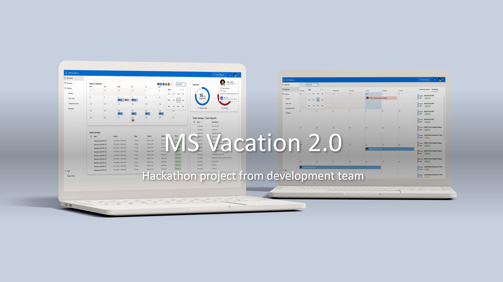
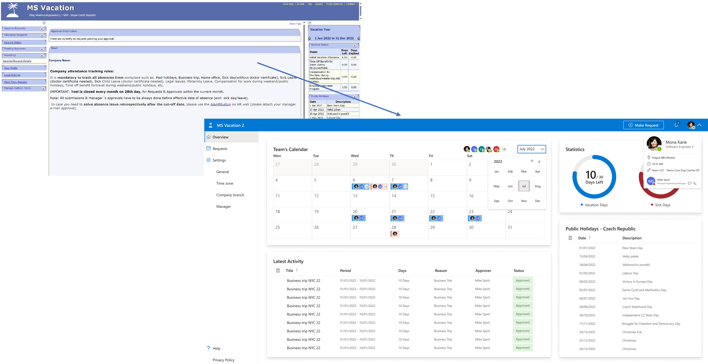

### Hackhathon 2022
# MS Vacation 2.0 

## Authors
|[Oleg Veselov](mailto:olegveselov@microsoft.com)  |  [Volodymyr Mykhailets](mailto:vmykhailets@microsoft.com) |
|---|---|

## Description
Fresh view to the well-known MS Vacation tool.
New UI uses the Fluent UI system/components/icons.

We did research to compare current MS Vacation tool and modern similar systems.  
Finally, we've created a lot of user stories to understand what we wanna see in the new tool and user flow to know how it should work so the UI/UX design builds on these results.

## Tools

### Design and code
* *[Figma](https://www.figma.com/) - UI Design*
* *[Miro](https://miro.com/) - user flow*
* *[VS Code](https://code.visualstudio.com/) - our favorite code editor =)*
### Project contains
* *[React](https://reactjs.org/)*
* *[React-router](https://github.com/remix-run/react-router)*
* *[TypeScript](https://www.typescriptlang.org/)*
* *[Yarn](https://yarnpkg.com/)*
* *[SCSS](https://sass-lang.com/)*
* *[Prettier](https://prettier.io/)*
* *[Fluent UI Components (@fluentui/react-northstar)](https://fluentsite.z22.web.core.windows.net/0.53.0/)*
* *[Fluent UI Icons](https://github.com/microsoft/fluentui-system-icons/blob/main/icons_regular.md)*

## How to run project
yarn install
yarn start

Open [http://localhost:3000](http://localhost:3000) to view it in the browser.

### Unit tests
(￣y▽￣)╭ Coming soon...
